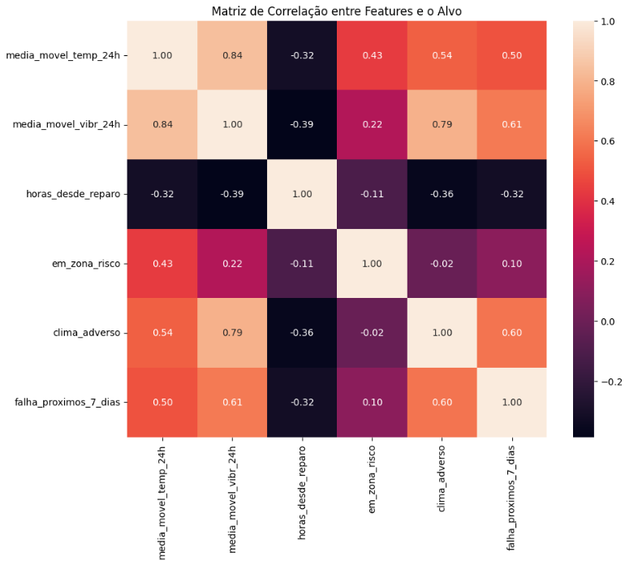
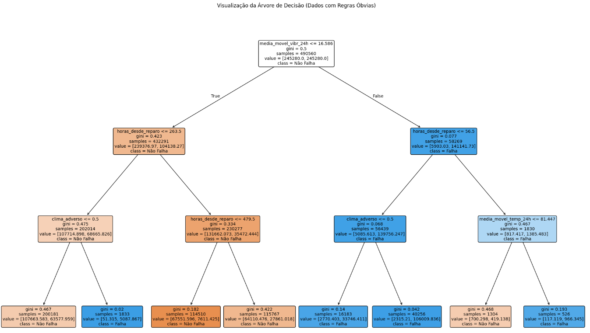
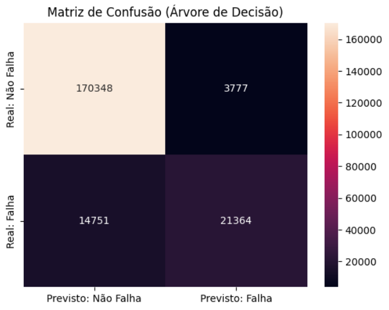

# 🚀 PoC: Manutenção Preditiva de Rebocadores para a Wilson Sons

[](https://pt.wikipedia.org/wiki/Manuten%C3%A7%C3%A3o_preditiva) [](https://www.python.org/)[](https://scikit-learn.org/)[](https://pandas.pydata.org/)[](https://seaborn.pydata.org/)


---

## 🎯 O Desafio de Negócio

Em um setor ultracompetitivo como o de logística marítima, a manutenção não planejada de um rebocador representa um grande risco financeiro e operacional para a Wilson Sons. O modelo tradicional de manutenção preventiva (baseado em tempo) é ineficiente, pois não considera as condições reais de operação.

**O objetivo desta Prova de Conceito (PoC) é demonstrar a viabilidade de um modelo de Machine Learning para prever falhas em equipamentos, transformando a manutenção reativa em uma vantagem competitiva e estratégica.**

---

## 📊 Análise Visual e Resultados do Modelo

A seguir estão os principais resultados visuais do projeto, que demonstram como os dados foram transformados em inteligência acionável.

### Gráfico 1: Matriz de Correlação - Quais Fatores Mais Influenciam a Falha?
Esta matriz de correlação foi fundamental para validar as hipóteses da engenharia de atributos. Ela mostra visualmente que variáveis como `horas_desde_reparo` e a `media_movel_vibr_24h` têm a maior correlação com a variável-alvo (`falha_proximos_7_dias`), provando que são preditores importantes.

<!--  COLE A IMAGEM DA SUA MATRIZ DE CORRELAÇÃO AQUI -->


<details>
<summary>💻 Clique para ver o código que gera este gráfico</summary>

```python
# 1. Selecionar apenas as colunas numéricas de interesse
colunas_para_correlacao = [
    'media_movel_temp_24h',
    'media_movel_vibr_24h',
    'horas_desde_reparo',
    'em_zona_risco',
    'clima_adverso',
    'falha_proximos_7_dias' # Nosso alvo
]
df_corr = df_modelagem[colunas_para_correlacao]

# 2. Calcular a matriz de correlação
matriz_correlacao = df_corr.corr()

# 3. Plotar o heatmap
plt.figure(figsize=(10, 8))
sns.heatmap(
    matriz_correlacao,
    annot=True,      # Mostrar os números dentro dos quadrados
    fmt='.2f',       # Formatar os números com 2 casas decimais
    cmap='Blues'
)
plt.title('Matriz de Correlação entre Features e o Alvo')
plt.show()
```

</details>

### Gráfico 2: Árvore de Decisão - Como o Modelo Pensa?
A interpretabilidade é chave para a confiança no modelo. A Árvore de Decisão abaixo não é uma "caixa-preta": ela mostra exatamente as regras que o algoritmo aprendeu para classificar uma operação como "Falha" ou "Não Falha". Podemos seguir cada nó para entender o raciocínio por trás de cada previsão.

<!-- COLE A IMAGEM DA SUA ÁRVORE DE DECISÃO AQUI -->


<details>
<summary>💻 Clique para ver o código que gera este gráfico</summary>

```python
plt.figure(figsize=(25, 15))

plot_tree(
    tree_model,
    feature_names=features,
    class_names=['Não Falha', 'Falha'],
    filled=True,
    rounded=True,
    fontsize=10
)

plt.title("Visualização da Árvore de Decisão")
plt.show()
```
</details>

### Gráfico 3: Matriz de Confusão Detalhada
Esta matriz visualiza a performance do modelo, mostrando os acertos e erros. É crucial para entender onde o modelo está acertando (Verdadeiros Positivos e Verdadeiros Negativos) e onde ele está "confundindo" as classes (Falsos Positivos e Falsos Negativos). Para a Wilson Sons, minimizar os Falsos Negativos (falhas não previstas) é de extrema importância para evitar custos com manutenção emergencial.

<!-- COLE A IMAGEM DA SUA MATRIZ DE CONFUSÃO DETALHADA AQUI -->


<details>
<summary>💻 Clique para ver o código que gera este gráfico</summary>

```python
# Seu código da Matriz de Confusão com Verdadeiro/Falso Positivo/Negativo aqui
# (Use o código da Opção 1 que sugeri anteriormente)
# 1. Fazer previsões e calcular a matriz de confusão (você já tem isso)
y_pred = tree_model.predict(X_test)
cm = confusion_matrix(y_test, y_pred)

# 2. Criar os rótulos personalizados
tn, fp, fn, tp = cm.ravel()

labels = [
    f'Verdadeiro Negativo\n\n{tn}', f'Falso Positivo\n\n{fp}',
    f'Falso Negativo\n\n{fn}', f'Verdadeiro Positivo\n\n{tp}'
]
labels = np.asarray(labels).reshape(2, 2)

# 3. Plotar o heatmap com as etiquetas personalizadas
plt.figure(figsize=(10, 8))
sns.heatmap(cm,
            annot=labels,
            fmt='',
            cmap='Blues',
            xticklabels=['Previsto: Não Falha', 'Previsto: Falha'],
            yticklabels=['Real: Não Falha', 'Real: Falha'],
            annot_kws={"size": 12}
           )

plt.title('Matriz de Confusão Detalhada', fontsize=16)
plt.ylabel('Classe Real', fontsize=14)
plt.xlabel('Classe Prevista', fontsize=14)
plt.show()
```
</details>

---

## 🛠️ Tecnologias e Habilidades Demonstradas

- **Análise Exploratória de Dados (AED):** Investigação e visualização para encontrar padrões e insights.
- **Engenharia de Atributos (Feature Engineering):** Criação de variáveis preditivas a partir de dados brutos.
- **Modelagem Preditiva:** Utilização do Scikit-learn para treinar e avaliar um modelo de classificação (Árvore de Decisão).
- **Interpretabilidade de Modelos:** Foco em modelos "white-box" para explicar as previsões.
- **Boas Práticas de Código:** Uso de ambientes virtuais, versionamento com Git e organização de projeto.
- **Bibliotecas:** Pandas, NumPy, Matplotlib, Seaborn, Scikit-learn.

---

## ⚙️ Como Executar o Projeto

1.  **Clone o repositório:**
    ```bash
    git clone https://github.com/JhonAI13/ETL_Winson_sons.git
    ```

2.  **Crie e ative um ambiente virtual:**
    ```bash
    python -m venv venv
    venv\Scripts\activate  # No Windows
    # source venv/bin/activate  # No macOS/Linux
    ```

3.  **Instale as dependências:**
    ```bash
    pip install -r requirements.txt
    ```

4.  **Abra o Jupyter Notebook:**
    Navegue até a pasta `notebook/` e abra o arquivo `poc_wilson_sons.ipynb`.

---

## 👨‍💻 Autor
Trabalho realizado por **Jonathas Martins da Rocha**.
Conecte-se comigo e explore mais projetos:

[](https://www.linkedin.com/in/jonathas-rocha/)
[](https://jonathasmartinsdata.my.canva.site/)
